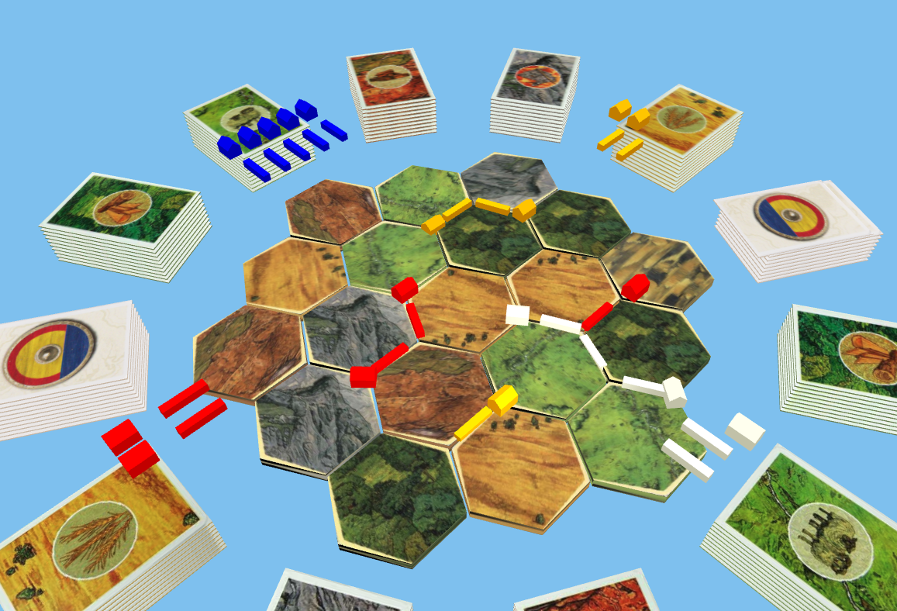

# Katan

Stuck inside because of global pandemics?
Can't visit your friends to play board games?
Tired of playing board games online that lack the *fun* of physical pieces?

Introducing... another shitty online katan (plz don't sue me)!



## Getting Started

### install

```bash
git clone git@github.com:JacobJaffe/Katan.git katan
cd katan
npm install
```

### Running

From the project root:

```bash
npm start
```

## Controls

- click and drag pieces & cards. While a piece is selected, you can rotate it with `q` and `e`.
- rotate camera with `a` and `d`.
- Sorry Dvoark users (@mgreenw), no key mapping yet. That would be a good feature actually.

## Todo

- [ ] Control-Z functionality for unmoving a piece?
- [ ] Dev Card assets
- [ ] Fix tile assets from being skewed
- [ ] Board initialization given a config / layout
- [ ] Tile numbers
- [ ] Cities
- [ ] Robber
- [ ] Show if someone else is moving a piece?
- [ ] Add player hand near avatar
- [ ] Flipping dev cards? 
- [ ] Harry's Sheep and other fun assets
- [ ] Server (LOL that's like half the work) streaming location updates via socket
- [ ] Add player avatar at camera location, looking in direction of mouse (requires server)
